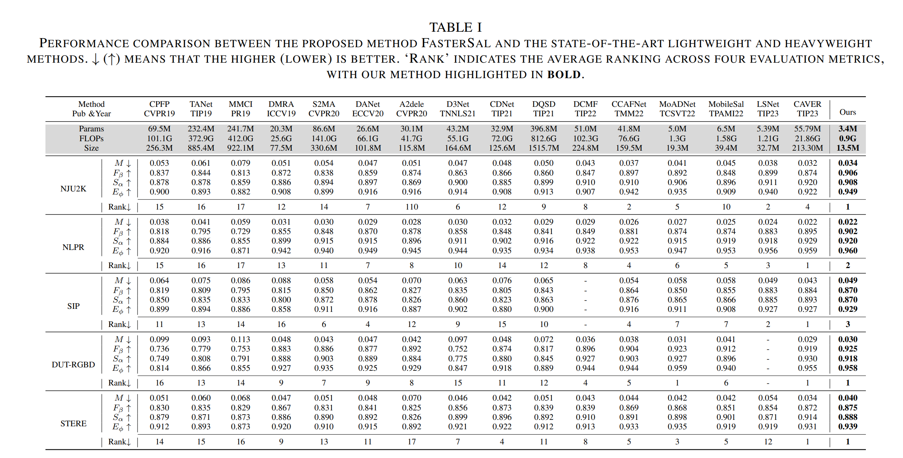

# FasterSal: Robust and Real-time Single-Stream Architecture for RGB-D Salient Object Detection

## Update

We are happy to announce that our manuscript **"FasterSal: Robust and Real-time Single-Stream Architecture for RGB-D Salient Object Detection"** has been accepted for publication in **IEEE Transactions on Multimedia (TMM)**.

You can access the paper through the following link:  
[**FasterSal: Robust and Real-time Single-Stream Architecture for RGB-D Salient Object Detection** - IEEE Xplore](https://ieeexplore.ieee.org/document/10814716)

## Open Source Code

All code related to **FasterSal** will be open-sourced once the manuscript is accepted and made publicly available. We appreciate your patience and will update this repository with the code in due course.

## Result Maps

Our predicted maps on the RGBD SOD datasets can be found at the following [Google Drive Link](https://drive.google.com/file/d/1hsRvbdfTd0vl8DqJuSAqAoztN1TOr-Yt/view?usp=drive_link).

## Datasets

The training and testing datasets used in our experiments can be accessed at the following [GitHub Repository](https://github.com/jiwei0921/RGBD-SOD-datasets).
